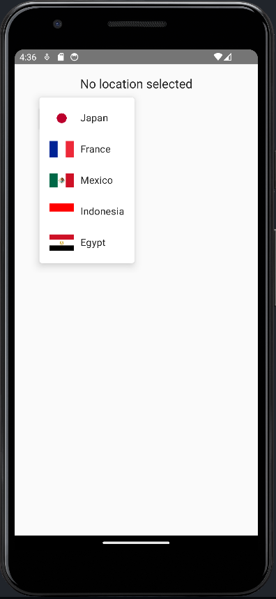
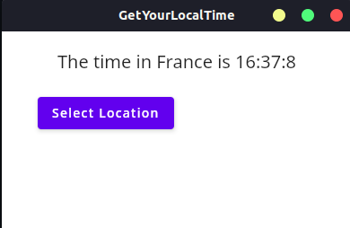

# GetYourLocalTime

This is a simple Kotlin Compose Multiplatform application that allows users to select a country and display its local time.

> This is my first attempt building an application wit Kotlin CMPP.

## Overview

This project is built using [Compose Multiplatform](https://www.jetbrains.com/lp/compose-multiplatform/) and [Jetpack Compose](https://developer.android.com/jetpack/compose), 
enabling the app to run on multiple platforms (Android, Desktop) with a single codebase. The app features an interface where users can choose a country from a list and 
view the current local time for that selected country.

## Features

- Select a country from a list.
- Display the local time of the selected country.
- Cross-platform support using Kotlin Multiplatform.

This project is from the Tutorial [Create your own application](https://www.jetbrains.com/help/kotlin-multiplatform-dev/compose-multiplatform-new-project.html) from jetbrains.com.

